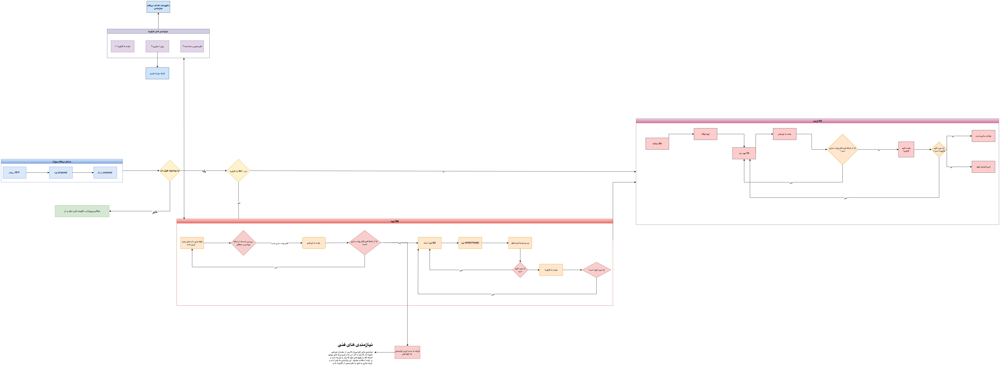
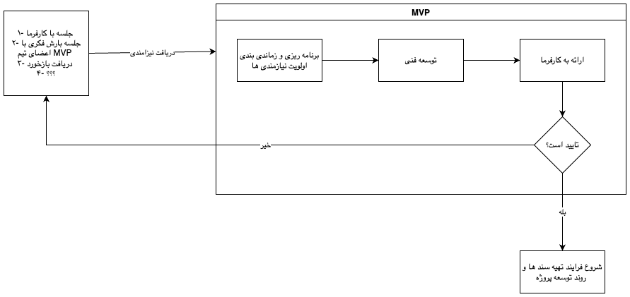
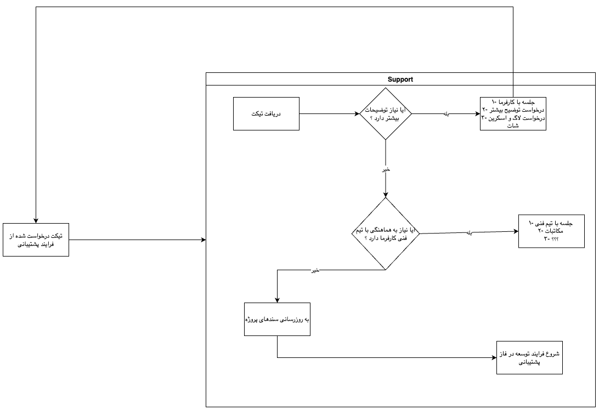

## فرایند توسعه محصول
در اولین قدم باید طبق نیازمندی مشتری، نیازمندی ها احصا شود. اگر کارفرما RFP در اختیار داشت نیازمندی ها از RFP استخراج و در غیر این صورت یک RFP برای کارفرما با سوالات زیر تهیه می‌گردد.

 1. هدف پروژه چیست؟
 2.  نمونه شبیه به چیزی که میخواهد
 3.  نمایش و نظرسنجی و یافتن نیازهای کارفرما
 4.  گرفتن user story برای قسمتهای اصلی و تایید آن
 5.  بررسی داکیومنتهای نظام صنفی رایانه ای(موجود در کانفول تولیدی آقای نیارکی)
 6.  بر اساس استانداردهای user story
 7.  احصا ماژولها
 8.  ارسال کتبی ماژولها با user story در کنار آن
 9.  دریافت واکنش نسبت به ماژولها

در فرایند زیر روند پیشنهادی تحلیل و دریافت نیازمندی آورده شده است.

## MVP
اگر پروژه در مرحله دادن MVP باشد، به دلیل وجود فورس زمانی و گرفتن بازخورد ها باید از روش RAD  یا (Rapid application development) استفاده کرد. در این روش به جای جلسات های متعدد و

تنظیم و تدوین سند ، سریعا ایده های مطرح شده به محصول قابل ارائه تبدیل میشود و محصول به کارفرما ( منظور از کارفرما کسی است که هدف پروژه و نیازمندی ها را میداند. این فرد ممکن است از مدیران شرکت یا از کارفرما باشد ( stackHolder )). پس از اینکه پروژه به تایید برای دولوپ رسید و از فورس زمانی خارج شد، اسناد و نیازمندی ها باید طبق فرایند بالا تهیه و تنظیم شوند.

## Support
اگر فاز یا فازهایی از پروژه تحویل شده باشد، آن فاز وارد مرحله پشتیبانی میشود. البته این بدین معنی نیست که افزودن امکانات مورد نیاز کارفرما به پروژه تمام شده باشد، بلکه باید پروژه به صورتی باشد که کارفرما پس از ثبت درخواست در زمانبندی ارائه شده نیازمندی خود را دریافت کند.

نکات حائز اهمیت:

-   فرایند تیکت فرایندیست که در آن بحث های تایید و یا رد باگ یا نیازمندی انجام میگیرد.
-   بحث های قراردادی و مالی در فرایند تکت است.
-   در فراند تولید و توسعه نیازمندی گفته شده باید کل محصول از ۰ تا ۱۰۰ تست شود.
-   با توجه به نیازمندی، در صورت وجود تیم فنی و نگهداری کارفرما، هماهنگی کامل با تیم آنها باید صورت گیرد(در مورد مسئولیت های از دست رفتن داده یا تغییر و ... باید هشدار داده شود).
-   به روز رسانی سند باید در هر جایی که مربوط است انجام شود ( BA,FA,FIGMA,TEST,... )

