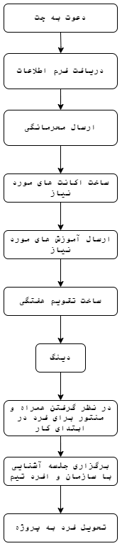

# آنبوردینگ

فرایند آنبوردینگ به شرح زیر است:

جدول زیر نیز شامل چک لیست آنبوردینگ هر فرد است که پس از اتمام فرایند استخدام، این چک لیست برای هر شخص طی می‌شود.

| نام و نام خانوادگی | پوزیشن        | اکانت چت   | آغاز همکاری | گروه هماهنگی ها | فرم اطلاعات | محرمانگی   | تفاهم نامه کارآموزی و کارورزی | جلسه نهایی با آقای نیارکی | اکانت Jira (به همراه ایجاد پروژه شخصی) | اکانت Confluence (صرفا با جیرا سینک شود.) | پروژه شخصی | دی-نگ      | تقویم همکاران  | اکانت Cloud (در صورت نیاز ) | اطلاعات پرداختی ماه اول | آپلود اطلاعات در Cloud | پروفایل پرسنلی | حضوری/دورکار | تحویل فرد به پروژه | ارسال متریک های ارزیابی | دفترچه تلفن |
|--------------------|---------------|------------|-------------|-----------------|-------------|------------|-------------------------------|---------------------------|----------------------------------------|-------------------------------------------|------------|------------|----------------|-----------------------------|-------------------------|------------------------|----------------|--------------|--------------------|-------------------------|-------------|
| محمد حسن زارع زاده | کارشناس تحلیل | 1402/08/03 | \-          | 1402/08/06      | 1402/08/06  | 1402/08/03 | \-                            |                           | 1402/08/06                             | 1402/08/06                                | 1402/08/06 | 1402/08/06 | ندارد          | فعلا نیاز نیست              |                         |                        | ندارد          | حضوری        | CODAL              |                         |             |
